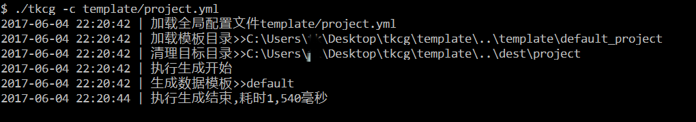
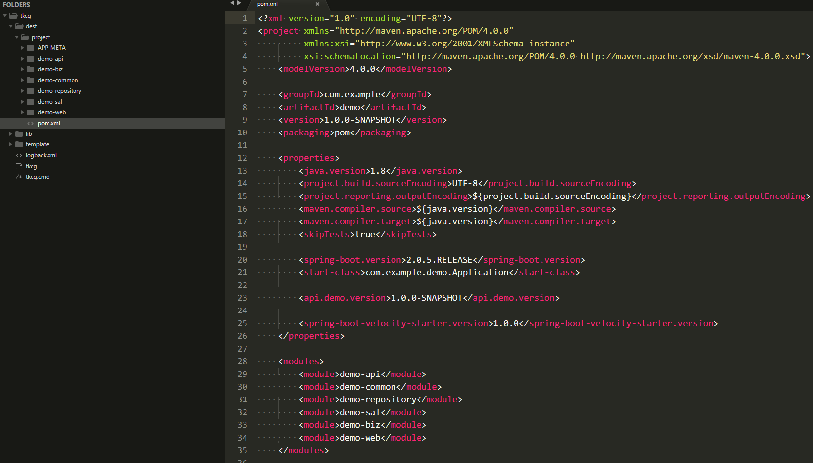

## 快速开始

* 演示两个常用示例
* 第一个示例生成spring-boot应用，项目结构可以个性化定制。  
* 第二个示例生成业务代码， 代码结构也可以个性化定制， 逆向mysql数据库，包含model，dao，service，api，test等。

## 下载生成器
* 下载程序包，[tkcg-cmd-1.6.0-bin.zip](https://github.com/freedommedal/tkcg/releases/download/1.6.0/tkcg-cmd-1.6.0-bin.zip)，并解压到本地
* 进入解压目录，并在解压目录打开命令行  
* 运行程序，显示帮助  
* windows用户运行命令`.\tkcg -h`  
* mac用户运行命令`./tkcg -h`  

## 生成项目骨架
* 调用生成项目命令
* windows用户运行命令 `.\tkcg -c template\project.yml`
* mac用户运行命令 `./tkcg -c template/project.yml`

* 查看解压目录下`./dest/project`目录下生成的内容

## 生成业务代码
* 调用生成业务命令
* windows用户运行命令 `.\tkcg -c template\code.yml`
* mac用户运行命令 `./tkcg -c template/code.yml`

* 查看解压目录下`./dest/code`目录下生成的内容

