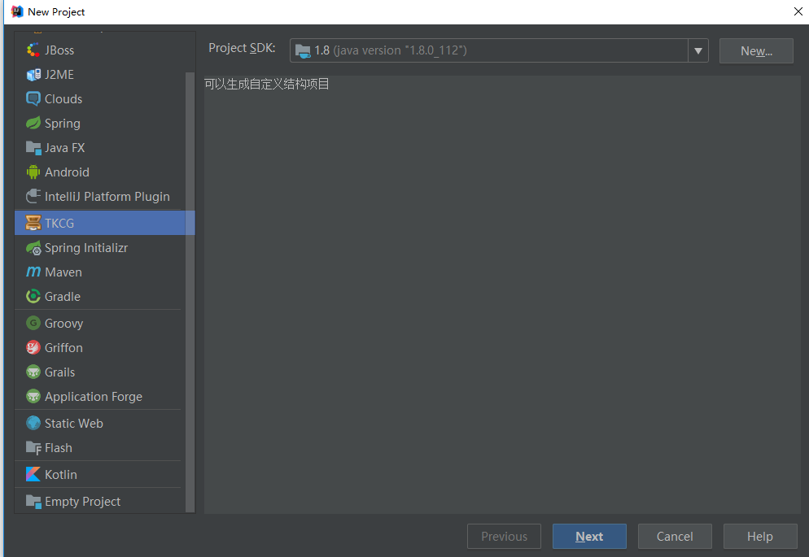
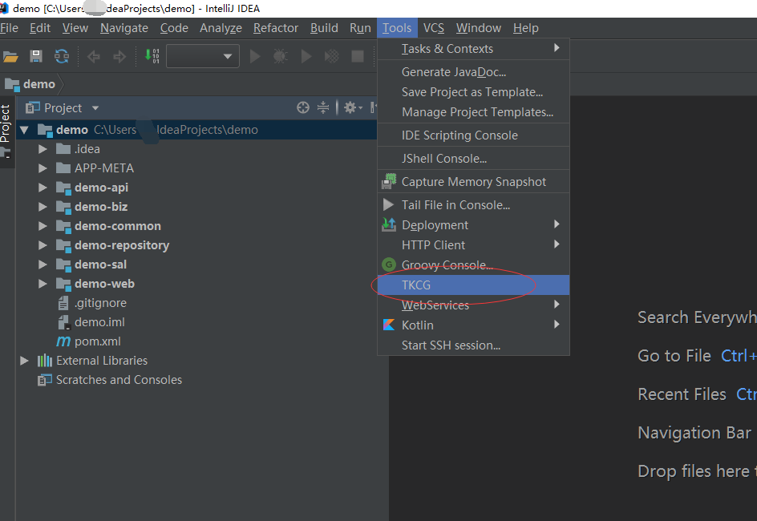

## 快速开始

* 使用idea生成项目结构,同时根据数据库表,逆向生成业务代码

## 安装插件
* 菜单栏选择`File->Settings->Plugins`,点击按钮`Browse Repositories`,在搜索栏中输入`TKCG`,查找插件,点击按钮`Install`,安装插件成功后,重启idea.

## idea创建项目
* 使用idea创建项目,选择TKCG类别

* 点击next按钮,输入项目信息

* 点击next按钮,输入项目位置,点击`Finsh`按钮进行创建项目

* 等待执行完成后,在项目中选择pom.xml文件,右键菜单,点击`Add as Maven Project`按钮,进行maven功能支持,至此项目创建完成  

## idea生成业务代码
* 菜单栏选择`Tools`,点击`TKCG`按钮

* 在打开的对话框,输入数据库等信息(注意输出路径,程序会覆盖同名文件),并点击`OK`按钮,待执行成功后,查看生成的代码

